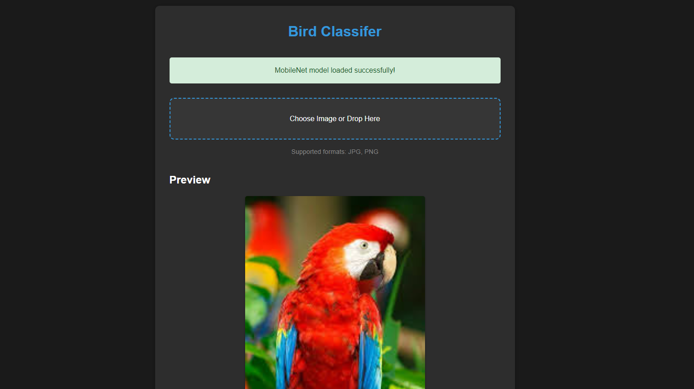

# 🖼️ Image Classifier using ML5.js

An interactive web application that uses ML5.js and MobileNet to classify images. The application features a modern dark theme and provides real-time image classification with confidence scores.

## 🌟 Features

- Real-time image classification using MobileNet
- Drag and drop file upload support
- Modern dark theme interface
- Visual confidence scores
- Responsive design
- Support for multiple image formats
- Interactive loading states

## 🚀 Demo

[Live Demo](https://img-m5-class.netlify.app/) 

**Input**
 
**Output**
 

## 🛠️ Technologies Used

- HTML5
- CSS3
- JavaScript
- ML5.js
- MobileNet Model

## 📦 Installation

1. Clone the repository:
```bash
git clone https://github.com/your-username/Image-Classifier-ML5.git
```

2. Navigate to the project directory:
```bash
cd Image-Classifier-ML5
```

3. Open the project:
   - Open `index.html` in your web browser
   - Or use a local development server:
     ```bash
     python -m http.server 8000
     ```
     Then visit `http://localhost:8000`

## 💻 Usage

1. Wait for the MobileNet model to load
2. Upload an image by:
   - Clicking the upload button
   - Dragging and dropping an image
3. View the classification results with confidence scores
4. Use the "Try Another Image" button to classify more images

## 🤝 Contributing

Contributions, issues, and feature requests are welcome! Feel free to check the [issues page](https://github.com/smaranjitghose/image-classifier-ml5/issues).

## 📝 License

This project is [MIT](LICENSE) licensed.

## 👤 Author

Your Name
- GitHub: [@smaranjitghose](https://github.com/smaranjitghose)
- LinkedIn: [Smaranjit Ghose](https://www.linkedin.com/in/smaranjitghose/)
